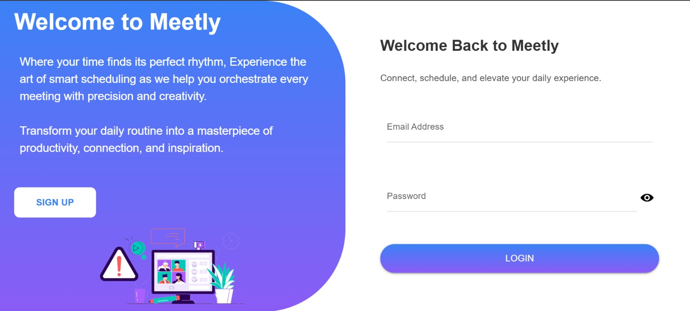

# 📆 Meetly — Intelligent Academic Scheduling Platform

Welcome to **Meetly** — a smart, full‑stack scheduling solution designed to revolutionize one‑on‑one meeting coordination between students and professors. With its intuitive interface, robust backend, and intelligent matching algorithms, Meetly takes the hassle out of booking, waitlisting, and rescheduling meetings, so you can focus on what really matters: building meaningful academic connections.





---

## 🎯 Why Meetly?

Meetly was created to address common scheduling headaches:
- **Automate the Booking Process:** Students can reserve slots with just a click.
- **Maximize Slot Utilization:** Intelligent matching quickly fills freed slots.
- **Manage Waitlists Effortlessly:** A dynamic FIFO queue ensures fairness.
- **Seamlessly Handle Rescheduling:** Chain rescheduling with multi‑party approvals prevents missed opportunities.
- **Respect User Preferences:** Students set preferred times to improve matching accuracy.
- **Real‑Time Notifications:** Stay informed with live updates on your meeting status.

---

## 🏗 System Architecture

Meetly is built on a modern, scalable stack:

- **Frontend:** Built with NiceGUI (Python) and FullCalendar (JavaScript) to deliver a sleek, interactive user experience.
- **Backend:** Powered by FastAPI, ensuring a secure and efficient API with JWT authentication.
- **Database:** Uses SQLAlchemy ORM to manage a robust relational schema.

---

## 🔍 Deep Dive: Core Components

### Backend API (FastAPI)

- **Authentication:**  
  - **JWT-based Login/Signup:** Secure access with role‑based permissions (student vs. professor).
  - **OAuth2PasswordBearer:** Simplifies token management.

- **Data Models:**  
  - **User:** Captures both student and professor profiles.
  - **SlotTime:** Represents available meeting windows.
  - **Meeting:** Links students, professors, and slots.
  - **WaitList:** Manages queued bookings for fully occupied slots.
  - **PreferredTime:** Stores student availability preferences.
  - **RescheduleRequest & Notification:** Handle multi‑party swap workflows and alert users of changes.

- **Matching Engine:**  
  - **Bipartite Graph Construction:** Maps students to their preferred slots.
  - **DFS & BFS Algorithms:**  
    - **DFS (`_find_augmenting_path`):** Finds augmenting paths to maximize matching.
    - **BFS (`try_single_user_bfs_in_memory`):** Efficiently seeks the shortest path for waitlisted students.
  - These algorithms ensure optimal assignment and minimal disruptions.

### Frontend (NiceGUI + FullCalendar)

- **NiceGUI Components:**  
  - **Login/Signup Pages:** Elegant, responsive pages built entirely in Python.
  - **Calendar Dashboard:** A dynamic calendar view that aggregates available and booked slots.
  - **Modals & Dialogs:** Custom dialogs for creating slots, booking meetings, setting preferences, and managing notifications.
  - **LocalStorage Integration:** Persists JWT tokens, user roles, and IDs for secure API calls.

- **FullCalendar Integration:**  
  - **Interactive Views:** Month view that display real‑time booking data.
  - **Event Handling:** Date click actions trigger modal dialogs for slot creation or meeting booking.
  - **Live Updates:** JavaScript functions seamlessly refresh events after any changes.

---

## 📦 Database Schema Overview

| **Table**                | **Purpose**                                           | **Key Columns**                                 |
|--------------------------|-------------------------------------------------------|-------------------------------------------------|
| **users**                | Stores student and professor profiles               | `id`, `name`, `email`, `password`, `role`         |
| **slot_times**           | Represents available meeting slots                  | `id`, `professor_id`, `start_time`, `end_time`, `is_booked` |
| **meetings**             | Captures confirmed bookings                         | `id`, `slot_id`, `student_id`, `professor_id`, `meeting_details` |
| **waitlist**             | Queues students for booked slots                    | `id`, `slot_id`, `user_id`, `created_at`          |
| **preferred_times**      | Records student availability preferences            | `id`, `user_id`, `time_slot`                      |
| **reschedule_requests**  | Manages chain rescheduling proposals                | `id`, `user_ids`, `current_slot_ids`, `new_slot_ids`, `professor_ids`, `status` |
| **notifications**        | Delivers in‑app alerts about scheduling changes     | `id`, `user_id`, `message`, `is_read`, `reschedule_id` |

---

## ⚙️ API Endpoints

### **Authentication**
- **POST** `/api/auth/signup`  
  Create a new user account.
- **POST** `/api/auth/login`  
  Authenticate and receive a JWT token.

### **Slots**
- **POST** `/api/auth/create_slot`  
  Professors create a new meeting slot.
- **GET** `/api/auth/get_slots`  
  Retrieve all slots for calendar display.

### **Meetings**
- **POST** `/api/auth/book_slot`  
  Students book an available slot.
- **GET** `/api/auth/student/meetings`  
  List meetings booked by a student.
- **DELETE** `/api/auth/student/meetings/{id}`  
  Cancel an existing meeting.

### **Waitlist & Reschedule**
- **POST** `/api/auth/add_to_waitlist`  
  Join a waitlist for a fully booked slot.
- **POST** `/api/auth/reschedule_requests/{id}/accept`  
  Approve a reschedule request.
- **POST** `/api/auth/reschedule_requests/{id}/reject`  
  Decline a reschedule request.

### **Preferences**
- **GET / POST** `/api/auth/users/{user_id}/preferences`  
  Manage student time preferences.

### **Notifications**
- **GET** `/api/auth/notifications`  
  Retrieve notifications.
- **POST** `/api/auth/notifications/mark_as_read`  
  Mark a notification as read.

---

## 🖥 Installation & Setup

### Prerequisites
- Python 3.9+
- Virtual environment tool (e.g., venv)
- Database: PostgreSQL for production or SQLite for development

### Steps

1. **Clone the Repository**
   ```bash
   git clone https://github.com/your-org/meetly.git
   cd meetly
   ```

2. **Setup Virtual Environment**
   ```bash
   python3 -m venv .venv
   source .venv/bin/activate
   ```

3. **Install Dependencies**
   ```bash
   pip install -r requirements.txt
   ```

4. **Configure Environment Variables**
   - Copy `.env.example` to `.env` and set:
     - `SECRET_KEY`
     - `DATABASE_URL`
     - `ACCESS_TOKEN_EXPIRE_MINUTES`
     - Other necessary variables

5. **Run Database Migrations**
   ```bash
   alembic upgrade head
   ```

6. **Start the Development Server**
   ```bash
   uvicorn app.main:app --reload
   ```

7. **Access the Application**
   - **Login/Signup:** `http://localhost:8000/`
   - **Calendar Dashboard:** `http://localhost:8000/calendar`

---

## 🤖 Matching Algorithms: A Closer Look

### **Depth‑First Search (DFS) for Augmenting Paths**

- **Purpose:** To find a sequence of alternating unmatched and matched edges (an *augmenting path*) that can free up a slot for a student.
- **Process:**
  1. **For each preferred slot of a student:**  
     - If the slot is free, assign it immediately.
     - If occupied, recursively try to move the current occupant to another slot.
  2. **If the path is found:**  
     - Update the `slot_to_user` mapping along the path.
- **Benefit:** Maximizes the overall matching, ensuring more students get a slot.

### **Breadth‑First Search (BFS) for Single‑User Optimization**

- **Purpose:** To quickly find the shortest augmenting path for a single waitlisted student.
- **Process:**
  1. **Start from the waitlisted student:**  
     - Explore their preferred slots.
  2. **Alternate between students and slots:**  
     - Track the path using a predecessor map.
  3. **When a free slot is found:**  
     - Reconstruct the path and update assignments.
- **Benefit:** Minimizes the number of swaps needed, providing a quick, fair solution for individual cases.

---

## 🤝 Contributing

We welcome contributions! To get started:

1. **Fork the Repository**  
2. **Create a Feature Branch:**  
   ```bash
   git checkout -b feature/your-feature-name
   ```
3. **Commit Your Changes:**  
   Follow PEP8 and write tests for new functionality.
4. **Push & Open a Pull Request**

---

## 🌟 Happy Coding!

We hope Meetly inspires you to reimagine scheduling. Your contributions and feedback are always welcome — let's build the future of academic productivity together!
